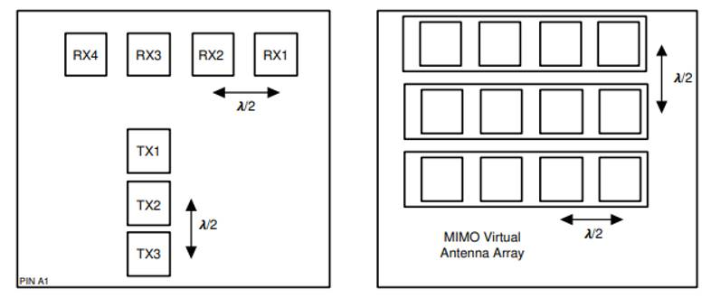

# Radar Sensor
Radar Sensor: AWR1843AOP based sensor on Efeubot customized to record raw adc data.

## Sensor Specifications

| Parameter              | Value                |
|------------------------|----------------------|
| Sensor Model           | AWR1843AOP           |
| Operating Frequency    | 77 - 81 GHz          |
| Field of View (Azimuth)| ±60° (8 dB Beamwidth)|
| Field of View (Elevation)| ±60° (8 dB Beamwidth)|
| Range Resolution       | 0.047 m              |
| Doppler Resolution     | 0.205 m/s            |
| Maximum Range          | 9.593 m              |
| Velocity Range         | ±6.563 m/s           |
| Update Rate            | 10 Hz                |


## Modulation Parameters and Timings


[From AWR1843AOP Technical Datasheet (TI)](https://www.ti.com/lit/ds/symlink/awr1843aop.pdf)

The radar operates in **TDM-MIMO** mode using all three transmit antennas (Tx0, Tx1, Tx2) sequentially. Key parameters related to modulation and signal timing are listed below:

| Parameter                     | Value                                      |
|------------------------------|--------------------------------------------|
| λ (at 79 GHz)                | 3.79 mm                                    |
| Number of Loops (N_Loops)    | 64                                         |
| Number of Chirps (complex)   | 256                                        |
| Number of Transmit Antennas  | 3                                          |
| Number of Receive Antennas   | 4                                          |
| Ramp End Time                | 40 µs                                      |
| ADC Sampling Time            | 32 µs                                      |
| ADC Valid Start Time         | 7 µs                                       |
| TX Start Time                | 1 µs                                       |
| TX End Time                  | 1 µs                                       |
| Idle Time                    | 8 µs                                       |
| Chirp Cycle Time             | 48 µs                                      |
| Frame Duration               | 9.216 ms                                   |
| Frequency Slope              | 100 MHz/µs                                 |
| ADC Sampling Frequency       | 8 MSps                                     |
| ADC Resolution               | 12-bit (for each Q & I Channel)            |
| Data Packing Format          | int16 (Q,I) = 32-bit/complex sample (4 B)  |
| Raw Data per Frame           | 786.432 Byte                               |
| Raw Data Rate                | 7.86 MByte/s                               |

---
## Extrinsic Calibration

The radar sensor is physically mounted on a mobile robot. For consistent and reproducible integration across different platforms, the extrinsic parameters (position and orientation of the sensor in the robot frame) are defined in a URDF (`.urdf.xacro`) file.

- **URDF File**: [AMR_sensors.xacro](../dataset_rosbag_viewer/ros1/urdf_viewer/urdf/AMR_sensors.xacro)


## Intrinsic Calibration

- **Range Calibration**: Fitted polynomial for converting range index to Cartesian coordinate.
```python
   def rangebin2meter(self, range_bin, bin_width=0.047, offset=-0.015):
      range_m = bin_width * range_bin + offset
      return np.clip(range_m, a_min=1e-3, a_max=None)
```
- **Angular Calibration**: Fitted function for converting angle bins to Cartesian coordinates.
```python
   def idx2deg(self, angle_idx, interp_size=128):
      idx_norm = (angle_idx / (interp_size - 1)) * 2 - 1  # idx_norm ∈ [-1, 1]
      # Fit parameters (from calibration)
      A = 37.542     # Output scaling factor (degrees)
      B = 1.312      # Input scaling factor (dimensionless)
      # Apply non-linear mapping with clipping to avoid invalid arcsin input
      arg = np.clip(B * idx_norm, -1, 1)
      # Return angle in degrees
      return A * np.arcsin(arg)
```

## Valid Range Bins
```
Total Bins: 256 * 0.047 m = 12.032 m
Maximum Unambiguous Range: 9.593 m
Valid Bins: 9.593 m / 0.047 m ≈ 204 Bins
```
---

## Raw ADC Data

Raw ADC data cubes in .mat format stored in the matfile directory. 

## Pointcloud Data

The pointcloud data from the on chip processing of the AWR1843AOP is also provided. Here the vanilla demo of MMWAVE-SDK 03.06.00.00-LTS [link](https://www.ti.com/tool/download/MMWAVE-SDK/03.06.00.00-LTS) was used with the following cfar cfg parameters:
```
...
cfarCfg -1 0 2 8 4 3 0 15 1
cfarCfg -1 1 0 4 2 3 1 15 1
...
cfarFovCfg -1 0 0 8.92
cfarFovCfg -1 1 -1 1.00
...
```
The point cloud data is available in two formats:

- **CSV Format**: Contains the fields `x`, `y`, `z`, `intensity`, and `radial_velocity`.
- **PCD Format**: Contains the fields `x`, `y`, `z`, and `intensity`.

The data is published in the `radar_link` frame, see **Extrinsic Calibration**.

## Images

All the following RF image combinations can be extracted from the raw data. Each image represents a different aspect of a simple radar signal processing output, useful for analysis and visualization.

| Image Name       | Description                                     |
|------------------|-------------------------------------------------|
| `azimuthAbs`     | Absolute values for range-azimuth               |
| `azimuthPhase`   | Phase values for range-azimuth                  |
| `dopplerAbs`     | Absolute values range-doppler                   |
| `dopplerPhase`   | Phase values for range-doppler                  |
| `elevationAbs`   | Absolute values range-elevation                 |
| `elevationPhase` | Phase values for range-elevation                |

## Demo scripts

The following demo scripts are provided to help you get started with radar data processing and visualization. Each script demonstrates a different aspect of working with the radar sensor data.

- [**01_demo_point_cloud_viewer.py**](../demo_scripts/radar/01_demo_point_cloud_viewer.py): Load, filter, and visualize radar point cloud data from CSV files. Useful for quick exploration of on-chip processed radar point clouds, with coloring by intensity or doppler velocity.
- [**02_demo_raw_data_viewer.py**](../demo_scripts/radar/02_demo_raw_data_viewer.py): Load, process, and visualize raw radar ADC data from .mat files. Demonstrates creation of range-azimuth and range-doppler images, enabling custom signal processing research.
- [**03_demo_point_cloud_2_rgb_projection_viewer.py**](../demo_scripts/radar/03_demo_point_cloud_2_rgb_projection_viewer.py): Project radar point clouds onto undistorted RGB images using camera calibration and extrinsic parameters. Visualizes spatial alignment between radar and camera data.